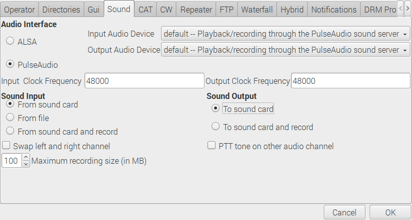
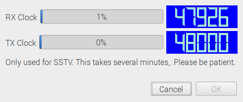

# Una configuración de decodificador SSTV para Raspberry OS.

¿Alguna vez has querido recibir una señal de radio del espacio? ¡Es divertido y en realidad mucho más fácil de lo que piensas!

## ¿Qué es Slow Scan Television (SSTV)?

- Respuesta corta:
  - Convierte una imagen en sonido, transmite el sonido por radio y vuelve a convertir el sonido recibido en una imagen en el otro extremo.

- Respuesta larga:
  - SSTV es un método de transmisión de imágenes para transmitir y recibir imágenes estáticas por radio. Similar a una máquina de fax, o un módem de acceso telefónico de los 90,       SSTV es una señal de audio analógica que suena como pitidos y chirridos de tono alto. Utiliza modulación de frecuencia, donde la frecuencia de un tono cambia hacia arriba o       hacia abajo para designar el brillo y el color de los píxeles. Una transmisión consta de líneas horizontales de píxeles, escaneadas de izquierda a derecha, codificadas como       audio. El audio se transmite por radio y se vuelve a convertir en imagen en el otro extremo mediante un software especial.

## ESPACIO
La estación espacial internacional tiene una gran [historia](https://www.spaceflightsoftware.com/ARISS_SSTV/archive.php) de transmisión de imágenes SSTV para [eventos globales](http://ariss-sstv.blogspot.com/) cada uno dura varios días, donde personas de todo el mundo sintonizan sus radios con la EEI e intentan recibir las imágenes cada vez que vuela sobre su hogar.

Por lo general, una imagen se transmite continuamente durante aproximadamente dos minutos con dos minutos de silencio antes de que comience la siguiente imagen. La EEI suele tardar unos 10 minutos en volar de horizonte a horizonte cuando pasa sobre tu casa, por lo que, cada vez, normalmente puedes obtener varias imágenes.


Es muy divertido participar en ellos y, a menudo, hay una sana competencia entre las personas para ver quién puede recibir las imágenes con mayor claridad.

Una recepción buena/perfecta | Una recepción con ruido/interferencia
--- | ---
|
Si obtienes uno tan bueno, lo estás haciendo *realmente* bien. | Parece que la EEI se fue por debajo del horizonte hacia el final de este.

Estas instrucciones le muestran cómo configurar una estación terrestre y recibir imágenes SSTV usando solo una computadora Raspberry Pi y un dongle USB RTL-SDR. 

¿Por qué usar una Raspberry Pi? Esto se puede hacer usando una PC de escritorio o Mac, sin embargo, a menudo es necesario dejar el receptor funcionando durante la noche, esperando que la ISS sobrevuele su ubicación, y generalmente es más fácil vincular una Raspberry Pi con esta tarea que su computadora utilitaria principal que usas todo el tiempo.

## Jugando con SSTV en un teléfono móvil
Para tener una reproducción rápida, es posible instalar una aplicación de teléfono móvil que decodifica SSTV a través de su entrada de micrófono. Reproducir los pitidos y chirridos de una señal SSTV con el teléfono colocado cerca del altavoz suele ser suficiente.

- Android: [Robot36](https://play.google.com/store/apps/details?id=xdsopl.robot36)
- Apple IOS: [CQ SSTV](https://itunes.apple.com/us/app/sstv-slow-scan-tv/id387910013)

Aquí hay un archivo de prueba MP3 que puedes [descargar](https://raw.githubusercontent.com/davidhoness/sstv_decoder/master/sstv_test.mp3) y reproducir

Esto debería funcionar en un salón de clases siempre que no haya demasiado ruido de fondo, si les pide a todos que instalen la aplicación y luego reproduzcan la grabación de prueba a un volumen razonable, todos los teléfonos decodificarán la imagen. Les dará a todos una buena idea de cuánto tiempo lleva obtener una imagen. Asegúrese de estornudar o toser a la mitad para mostrar cómo esto causa interferencia.

# Instrucciones principales
## ¿Qué vas a necesitar? 

- Raspberry Pi 3B o posterior, con los periféricos habituales.
- RTL-SDR USB dongle (search RTL2832U).
  - No compre las pequeñas antenas de montaje magnético de 30 cm. Tendrá poca o ninguna esperanza de recoger la ISS con ellos.
  - [Este kit de RTL-SDR](https://www.amazon.com/RTL-SDR-Blog-RTL2832U-Software-Telescopic/dp/B011HVUEME/) es bueno y viene con una buena antena dipolo para principiantes que captará la ISS.

## Configuración inicial y prueba
1. Puede encontrar una guía para configurar su Raspberry Pi [aquí](https://projects.raspberrypi.org/en/projects/raspberry-pi-setting-up).
1. Suponemos que está ejecutando la edición Raspberry OS disponible [aquí](https://www.raspberrypi.org/downloads/) y está conectado a internet.
1. Cambie la salida de audio a la toma de auriculares. Esto es necesario para la forma en que el pulso de audio vuelve en bucle al audio del sistema como un dispositivo de           entrada.

   - Inicio > Accesorios > Terminal;
   ```
   sudo amixer cset numid=3 1
   ```
   
1. Instale los requisitos previos.
    - Inicio > Accesorios > Terminal
    ```
    sudo apt-get update
    sudo apt-get install rtl-sdr sox pulseaudio qsstv ntpdate
    ```

1. Configure la hora correcta.
    - Inicio > Preferencias > Configuración de Raspberry Pi > pestaña Localización > Establecer zona horaria
    - Cambie el área y la ubicación en consecuencia> Aceptar
    - Inicio > Accesorios > Terminal
    ```
    sudo ntpdate pool.ntp.org
    ```

1. Inserte el dongle RTL-SDR y conecte/despliegue la antena.
1. Verifique que RTL-SDR esté funcionando con el comando `rtl_test`.
    - Inicio > Accesorios > Terminal
    ```
    rtl_test
    ```
    Salida resultante esperada:
    ```
    Found 1 device(s):
    0:  MAKE, MODEL, SN: 00000001
      
    Using device 0: Generic RTL2832U OEM
    Found MAKE MODEL tuner
    Supported gain values (XX): XX, XX, XX...
    [R82XX] PLL not locked!
    Sampling at 2048000 S/s.
    
    Info: This tool will continuously read from the device, and report if
    samples get lost. If you observe no further output, everything is fine.
    
    Reading samples in async mode...

    Deje actuar durante 30 segundos y esté atento a cualquier mensaje sobre pérdida de muestras.
    Pulse `Ctrl-C` cuando hayan transcurrido 30 segundos. La pérdida de unos 100 bytes es aceptable.
    ```
    
1. Verifique que RTL-SDR pueda sintonizar una estación de radio FM comercial con el programa `rtl_fm`. El siguiente comando canaliza los datos sin procesar de `rtl_fm` a sox         `play`, que luego decodificará los datos sin procesar para producir una salida de audio. Modifique el valor después de `-f` para especificar su propia estación/frecuencia FM     (98.8 es BBC Radio One en el Reino Unido).
     - Inicio > Accesorios > Terminal
    ```
    rtl_fm -M wbfm -f 98.8M | play -r 32k -t raw -e s -b 16 -c 1 -V1 -
    ```
    Salida resultante esperada:
    ```
    Found 1 device(s):
      0:  MAKE, MODEL, SN: 00000001
    Using device 0: Generic RTL2832U OEM
    -: (raw)
      Encoding: Signed PCM    
      Channels: 1 @ 16-bit   
    Samplerate: 32000Hz      
    Replaygain: off         
      Duration: unknown      
    Found MAKE MODEL tuner
    Tuner gain set to automatic.
    Tuned to 99071000 Hz.
    oversampling input by: 6x.
    Oversampling output by: 1x.
    Buffer size: 8.03ms
    Exact sample rate is: 1020000.026345 Hz
    Create UDP thread
    Created UDP thread
    Main socket started! :-) Tuning enabled on UDP/6020 
    Sampling at 1020000 S/s.
    Output at 170000 Hz.
    In:0.00% 00:00:02.60 [00:00:00.00] Out:XXXk  [ -====|====- ]        Clip:0    
    ```
    Tenga en cuenta que el valor `Tuned to` no coincide. Esto se debe al [pico de CC](https://www.rtl-sdr.com/tag/dc-spike/) y se puede ignorar. Ahora debería poder escuchar el audio de la estación de FM comercial. Mueva la antena o seleccione una estación de radio FM diferente con un transmisor más cercano si el audio es ruidoso. Presione `Ctrl-C` para salir de `rtl_fm`.
1.  Verifique que la configuración de QSSTV sea correcta.
    - Inicio > Internet > QSSTV
    - Opciones > Configuración > pestaña Sonido

     
     
    - Audio Interface = `PulseAudio`
    - Input and Output Audio Device = `default -- Playback/recording through the PulseAudio sound server`
    - Sound Input = `From sound card`
    - Sound Output = `To sound card`
    - OK

1.  Calibrar QSSTV.
    - Opciones > Calibrar

     
    - Ve a preparar una taza de té/café.
    - Haga clic en "Aceptar" cuando ambas barras de progreso alcancen el 99 %.


1.  Verifique que QSSTV descodifique correctamente el archivo de prueba de TV de exploración lenta.
    - Descargar archivo de prueba
    - Inicio > Accesorios > Terminal
    ```
    wget https://github.com/Juanmisa-code/Decodificador_SSTV/blob/main/sstv_test.mp3
    ```
