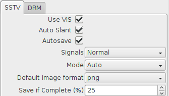
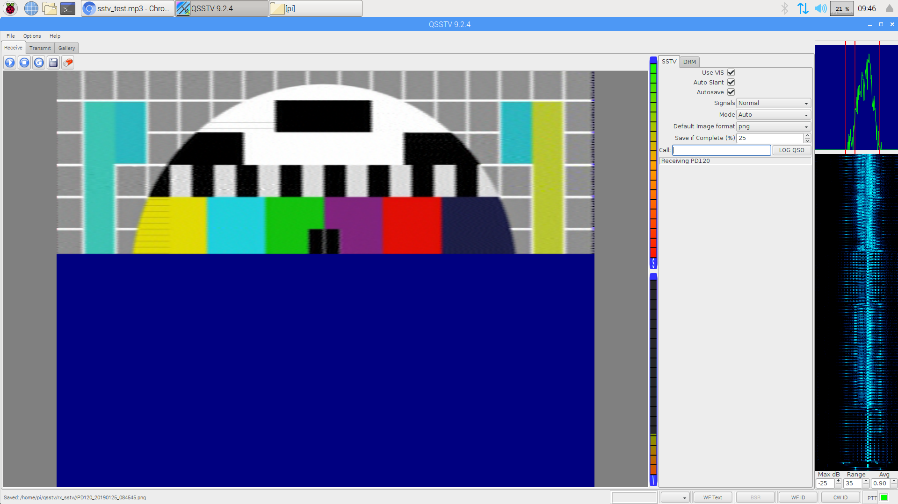

# Una configuración de decodificador SSTV para Raspberry OS.

¿Alguna vez has querido recibir una señal de radio del espacio? ¡Es divertido y en realidad mucho más fácil de lo que piensas!

## ¿Qué es Slow Scan Television (SSTV)?

- Respuesta corta:
  - Convierte una imagen en sonido, transmite el sonido por radio y vuelve a convertir el sonido recibido en una imagen en el otro extremo.

- Respuesta larga:
  - SSTV es un método de transmisión de imágenes para transmitir y recibir imágenes estáticas por radio. Similar a una máquina de fax, o un módem de acceso telefónico de los 90,       SSTV es una señal de audio analógica que suena como pitidos y chirridos de tono alto. Utiliza modulación de frecuencia, donde la frecuencia de un tono cambia hacia arriba o       hacia abajo para designar el brillo y el color de los píxeles. Una transmisión consta de líneas horizontales de píxeles, escaneadas de izquierda a derecha, codificadas como       audio. El audio se transmite por radio y se vuelve a convertir en imagen en el otro extremo mediante un software especial.

## ESPACIO
La estación espacial internacional tiene una gran [historia](https://www.spaceflightsoftware.com/ARISS_SSTV/archive.php) de transmisión de imágenes SSTV para [eventos globales](http://ariss-sstv.blogspot.com/) cada uno dura varios días, donde personas de todo el mundo sintonizan sus radios con la EEI e intentan recibir las imágenes cada vez que vuela sobre su hogar.

Por lo general, una imagen se transmite continuamente durante aproximadamente dos minutos con dos minutos de silencio antes de que comience la siguiente imagen. La EEI suele tardar unos 10 minutos en volar de horizonte a horizonte cuando pasa sobre tu casa, por lo que, cada vez, normalmente puedes obtener varias imágenes.


Es muy divertido participar en ellos y, a menudo, hay una sana competencia entre las personas para ver quién puede recibir las imágenes con mayor claridad.

Una recepción buena/perfecta | Una recepción con ruido/interferencia
--- | ---
|
Si obtienes uno tan bueno, lo estás haciendo *realmente* bien. | Parece que la EEI se fue por debajo del horizonte hacia el final de este.

Estas instrucciones le muestran cómo configurar una estación terrestre y recibir imágenes SSTV usando solo una computadora Raspberry Pi y un dongle USB RTL-SDR. 

¿Por qué usar una Raspberry Pi? Esto se puede hacer usando una PC de escritorio o Mac, sin embargo, a menudo es necesario dejar el receptor funcionando durante la noche, esperando que la ISS sobrevuele su ubicación, y generalmente es más fácil vincular una Raspberry Pi con esta tarea que su computadora utilitaria principal que usas todo el tiempo.

## Jugando con SSTV en un teléfono móvil
Para tener una reproducción rápida, es posible instalar una aplicación de teléfono móvil que decodifica SSTV a través de su entrada de micrófono. Reproducir los pitidos y chirridos de una señal SSTV con el teléfono colocado cerca del altavoz suele ser suficiente.

- Android: [Robot36](https://play.google.com/store/apps/details?id=xdsopl.robot36)
- Apple IOS: [CQ SSTV](https://itunes.apple.com/us/app/sstv-slow-scan-tv/id387910013)

Aquí hay un archivo de prueba MP3 que puedes [descargar](https://raw.githubusercontent.com/davidhoness/sstv_decoder/master/sstv_test.mp3) y reproducir

Esto debería funcionar en un salón de clases siempre que no haya demasiado ruido de fondo, si les pide a todos que instalen la aplicación y luego reproduzcan la grabación de prueba a un volumen razonable, todos los teléfonos decodificarán la imagen. Les dará a todos una buena idea de cuánto tiempo lleva obtener una imagen. Asegúrese de estornudar o toser a la mitad para mostrar cómo esto causa interferencia.

# Instrucciones principales
## ¿Qué vas a necesitar? 

- Raspberry Pi 3B o posterior, con los periféricos habituales.
- RTL-SDR USB dongle (search RTL2832U).
  - No compre las pequeñas antenas de montaje magnético de 30 cm. Tendrá poca o ninguna esperanza de recoger la ISS con ellos.
  - [Este kit de RTL-SDR](https://www.amazon.com/RTL-SDR-Blog-RTL2832U-Software-Telescopic/dp/B011HVUEME/) es bueno y viene con una buena antena dipolo para principiantes que captará la ISS.

## Configuración inicial y prueba
1. Puede encontrar una guía para configurar su Raspberry Pi [aquí](https://projects.raspberrypi.org/en/projects/raspberry-pi-setting-up).
1. Suponemos que está ejecutando la edición Raspberry OS disponible [aquí](https://www.raspberrypi.org/downloads/) y está conectado a internet.
1. Cambie la salida de audio a la toma de auriculares. Esto es necesario para la forma en que el pulso de audio vuelve en bucle al audio del sistema como un dispositivo de           entrada.

   - Inicio > Accesorios > Terminal;
   ```
   sudo amixer cset numid=3 1
   ```
   
1. Instale los requisitos previos.
    - Inicio > Accesorios > Terminal
    ```
    sudo apt-get update
    sudo apt-get install rtl-sdr sox pulseaudio qsstv ntpdate
    ```

1. Configure la hora correcta.
    - Inicio > Preferencias > Configuración de Raspberry Pi > pestaña Localización > Establecer zona horaria
    - Cambie el área y la ubicación en consecuencia> Aceptar
    - Inicio > Accesorios > Terminal
    ```
    sudo ntpdate pool.ntp.org
    ```

1. Inserte el dongle RTL-SDR y conecte/despliegue la antena.
1. Verifique que RTL-SDR esté funcionando con el comando `rtl_test`.
    - Inicio > Accesorios > Terminal
    ```
    rtl_test
    ```
    Salida resultante esperada:
    ```
    Found 1 device(s):
    0:  MAKE, MODEL, SN: 00000001
      
    Using device 0: Generic RTL2832U OEM
    Found MAKE MODEL tuner
    Supported gain values (XX): XX, XX, XX...
    [R82XX] PLL not locked!
    Sampling at 2048000 S/s.
    
    Info: This tool will continuously read from the device, and report if
    samples get lost. If you observe no further output, everything is fine.
    
    Reading samples in async mode...

    Deje actuar durante 30 segundos y esté atento a cualquier mensaje sobre pérdida de muestras.
    Pulse `Ctrl-C` cuando hayan transcurrido 30 segundos. La pérdida de unos 100 bytes es aceptable.
    ```
    
1. Verifique que RTL-SDR pueda sintonizar una estación de radio FM comercial con el programa `rtl_fm`. El siguiente comando canaliza los datos sin procesar de `rtl_fm` a sox         `play`, que luego decodificará los datos sin procesar para producir una salida de audio. Modifique el valor después de `-f` para especificar su propia estación/frecuencia FM     (98.8 es BBC Radio One en el Reino Unido).
     - Inicio > Accesorios > Terminal
    ```
    rtl_fm -M wbfm -f 98.8M | play -r 32k -t raw -e s -b 16 -c 1 -V1 -
    ```
    Salida resultante esperada:
    ```
    Found 1 device(s):
      0:  MAKE, MODEL, SN: 00000001
    Using device 0: Generic RTL2832U OEM
    -: (raw)
      Encoding: Signed PCM    
      Channels: 1 @ 16-bit   
    Samplerate: 32000Hz      
    Replaygain: off         
      Duration: unknown      
    Found MAKE MODEL tuner
    Tuner gain set to automatic.
    Tuned to 99071000 Hz.
    oversampling input by: 6x.
    Oversampling output by: 1x.
    Buffer size: 8.03ms
    Exact sample rate is: 1020000.026345 Hz
    Create UDP thread
    Created UDP thread
    Main socket started! :-) Tuning enabled on UDP/6020 
    Sampling at 1020000 S/s.
    Output at 170000 Hz.
    In:0.00% 00:00:02.60 [00:00:00.00] Out:XXXk  [ -====|====- ]        Clip:0    
    ```
    Tenga en cuenta que el valor `Tuned to` no coincide. Esto se debe al [pico de CC](https://www.rtl-sdr.com/tag/dc-spike/) y se puede ignorar. Ahora debería poder escuchar el audio de la estación de FM comercial. Mueva la antena o seleccione una estación de radio FM diferente con un transmisor más cercano si el audio es ruidoso. Presione `Ctrl-C` para salir de `rtl_fm`.
1.  Verifique que la configuración de QSSTV sea correcta.
    - Inicio > Internet > QSSTV
    - Opciones > Configuración > pestaña Sonido

     
     
    - Audio Interface = `PulseAudio`
    - Input and Output Audio Device = `default -- Playback/recording through the PulseAudio sound server`
    - Sound Input = `From sound card`
    - Sound Output = `To sound card`
    - OK

1.  Calibrar QSSTV.
    - Opciones > Calibrar

     
    - Ve a preparar una taza de té/café.
    - Haga clic en "Aceptar" cuando ambas barras de progreso alcancen el 99 %.


1.  Verifique que QSSTV descodifique correctamente el archivo de prueba de TV de exploración lenta.
    - Descargar archivo de prueba
    - Inicio > Accesorios > Terminal
    ```
    wget https://github.com/Juanmisa-code/Decodificador_SSTV/blob/main/sstv_test.mp3
    ```
    
    - Seleccione la pestaña `Recibir` en QSSTV.
    
    
    
    - Use VIS = `ON`
    - Auto Slant = `ON`
    - Autosave = `ON`
    - Signals = `Normal`
    - Mode = `Auto`
    - Haga clic en el botón reproducir `►`. No pasará nada, pero simplemente haga clic en él para iniciar el receptor.
    - Abra `sstv_test.mp3` en el navegador Chromium. Puede arrastrar y soltar el archivo desde el Administrador de archivos
    - Dejalo reproducir. Tenga en cuenta que con VLC Media Player a veces obtiene una imagen sesgada.

     
    
    - Observar la decodificación en QSSTV. Observe la actividad de visualización en cascada y FFT a la derecha de la pantalla.
    - Se pueden encontrar otras grabaciones de prueba de SSTV en línea, como: https://soundcloud.com/spacecomms/pd120-sstv-test-recording

## Nota sobre el desplazamiento Doppler
1.  ¿Qué es? Un ejemplo común de [desplazamiento Doppler](https://en.wikipedia.org/wiki/Doppler_effect) es el cambio de tono que se escucha cuando pasa un coche de policía o una ambulancia. En comparación con la frecuencia emitida por la sirena, la frecuencia que escucha es más alta durante la aproximación, idéntica en el instante de paso y más baja durante la salida. Con las ondas de radio ocurre lo mismo que con las ondas sonoras.
    - La EEI se mueve a ~27.600 km/h. Este movimiento provoca un desplazamiento Doppler en las ondas de radio recibidas en nuestra ubicación.
    - Para compensar los efectos del desplazamiento Doppler, las estaciones terrestres deben resintonizar continuamente su receptor a medida que la EEI se acerca, pasa por encima y se aleja.
    - A medida que la EEI se acerca al horizonte (AOS o Adquisición de señal por sus siglas en inglés), deberá sintonizar aproximadamente 3,5 kHz POR ENCIMA de 145,8 MHz.
    - En el instante en que la EEI está directamente sobre su cabeza, se puede utilizar la frecuencia de transmisión real de 145,8 MHz.
    - Justo antes de que la EEI descienda por el horizonte (LOS o Loss of Signal), deberá sintonizar aproximadamente 3,5 kHz POR DEBAJO de 145,8 MHz.
    - La cantidad de resintonización depende de la elevación de la EEI sobre el horizonte. Por ejemplo, un pase por encima de la cabeza requiere muchos ajustes porque hay un gran cambio en la distancia y la velocidad relativa a medida que pasa la EEI. Un paso de baja elevación, donde se asoma por encima del horizonte y vuelve a bajar, requiere relativamente poco.
    - No se realiza compensación de desplazamiento Doppler en la EEI. Todas las compensaciones deben ser manejadas por estaciones terrestres individuales.
    - Más información: https://www.qsl.net/ah6rh/am-radio/spacecomm/doppler-and-the-iss.html
    - Afortunadamente, **QSSTV puede lidiar con el desplazamiento Doppler por sí mismo** y, por lo tanto, no tiene que hacer nada para compensar después de sintonizar 145,8 MHz.
1.  Si desea realizar la corrección Doppler de todos modos, no hará ningún daño. De hecho, podría ser una buena actividad de codificación para un salón de clases.
1.  [Aquí](https://github.com/davidhoness/sstv_decoder/blob/master/doppler.py) hay un script de Python prefabricado para compensar el cambio de Doppler. Este programa rastrea la EEI usando `ephem`, calcula la frecuencia corregida por Doppler para cuando la ISS está pasando y vuelve a sintonizar `rtl_fm` a través de un conector UDP.
1.  Deberá modificar este script de python para establecer su ubicación. Puede buscar fácilmente la latitud y la longitud de su ubicación mediante [geocodificador de Google Maps](https://google-developers.appspot.com/maps/documentation/utils/geocoder/). Por lo general, el código postal y el país son suficientes.

## Recive imágenes de la EEI
1. Para hacer esto necesitas saber tres cosas:
    - Cuando la EEI estará transmitiendo la señal SSTV. **No siempre está encendido**.
    - En qué frecuencia se transmitirá la señal SSTV (normalmente 145,8 MHz).
    - Cuando la ISS sobrevuela tu ubicación.
      - La ISS sobrevuela la mayoría de los lugares varias veces al día (a menos que viva en el Ártico/Antártico).

1.  Puede averiguar cuándo la EEI está transmitiendo aquí: http://ariss-sstv.blogspot.com/
    - A menudo hay un evento SSTV en abril para el cumpleaños de Yuri Gagarin (el cosmonauta y piloto soviético que se convirtió en el primer hombre en viajar al espacio exterior).
    - Por lo general, duran unos días a la vez, lo que significa que obtendrá múltiples pases de la EEI durante los cuales puede recibir la señal SSTV.

1.  Puede consultar cuándo pasará la EEI por su ubicación en: https://www.heavens-above.com/
    - Haz clic en "Sin especificar" en la parte superior derecha para establecer tu ubicación.
    - Escriba **su** código postal y país en *Ingrese el lugar para buscar* y haga clic en `Buscar`.
    - Desplácese hacia abajo y haga clic en 'Actualizar'.
    - Ahora volverá a la página de inicio, en *Satélites*, haga clic en `ISS`.
    - En *Pases para incluir*, haga clic en `todos`.
        - El valor *Alt* debajo de *Punto más alto* es la elevación máxima del paso sobre el horizonte, 90 estaría directamente sobre su cabeza.
        - Los pases con mayor elevación máxima darán mejores resultados que los más bajos.
    - Al hacer clic en cualquier fila de la tabla, se muestra el **gráfico del cielo** para ese pase.
        - Imagina sostener esa imagen sobre tu cabeza y alinearla con las direcciones de la brújula.
        - La línea muestra la ruta de vuelo de la ISS y esto es útil para posicionar aproximadamente su antena.
        - También puede ser útil mirar la `Pista de tierra` (ver enlace en la parte superior derecha).
       
1.  Planifique con anticipación y configure su estación terrestre con tiempo de sobra antes de que la EEI sobrevuele.
1.  Si está utilizando la antena del kit RTL-SDR, lea la [guía de inicio](https://www.rtl-sdr.com/using-our-new-dipole-antenna-kit/) para ello.
    - Es una buena idea ajustar la longitud de los brazos telescópicos según este dipolo [calculadora](http://www.csgnetwork.com/antennaedcalc.html) para que coincida con la frecuencia de resonancia de la antena a 145,8 MHz. Esto ayudará a captar señales más débiles de pasos de baja elevación.
        - En `Frecuencia deseada` introduzca `145.8`
        - En 'Seleccionar cálculo de antena', seleccione 'Un lado'
        - Haga clic en `Calcular`
        - Recuerde que hay unos 2 cm de metal en cada lado de la base de la antena. Así que tome el valor calculado y, antes de atornillar los brazos, haga que ambos tengan esta           longitud menos 2 cm (excluyendo las roscas de los tornillos). No tiene que ser perfecto, pero hazlo lo más parecido posible.
    - Para empezar, despliega el dipolo en forma de v vertical y oriéntalo con la trayectoria de vuelo de la EEI que encuentras en https://www.heavens-above.com/
        - Quizás una mejor manera de decir esto es, con el dipolo plano, alinéelo con la trayectoria de vuelo de la ISS y luego doble los dos brazos hacia arriba en forma de V             en ángulo recto.
    - Las antenas y su desempeño son a veces una forma de arte en lugar de una ciencia exacta.
    - Experimenta con diferentes configuraciones en diferentes pases de la EEI. Pruebe con un brazo horizontal y un brazo vertical, por ejemplo.

1.  Trate de elevar su antena lo más alto posible con una buena vista del cielo en todas las direcciones.
1.  Configure la hora correcta en la Raspberry Pi. QSSTV guarda las imágenes con un nombre de archivo de hora UTC y esto es útil más adelante cuando se determina de qué pases EEI son.
    - Inicio > Accesorios > Terminal
     ```
    sudo ntpdate pool.ntp.org
    ```
1.  Inicie `rtl_fm` en una ventana de Terminal (mantenga esta ventana abierta)
    - Inicio > Accesorios > Terminal
    ```
    rtl_fm -M fm -f 145.8M -s 48k | play -r 48k -t raw -e s -b 16 -c 1 -V1 -
    ```
    - Tenga en cuenta que este comando es diferente al de la estación de radio comercial. Una estación de radio comercial usa FM de banda ancha, mientras que la transmisión ISS usa FM de banda estrecha, por lo que tenemos que configurar `rtl_fm` de manera diferente.
1.  **OPCIONAL:** Si está realizando la corrección Doppler, inicie `doppler.py` en *otra* ventana de Terminal (mantenga esta ventana abierta también).
